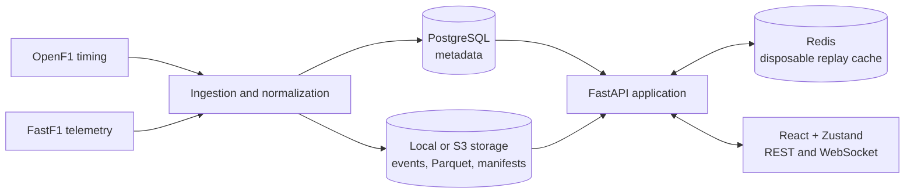

# Pitwall

**Historical Formula 1 race replay, analysis and strategy experimentation.**

[](https://github.com/mohika05/pitwall/actions/workflows/backend-tests.yml)
[](https://github.com/mohika05/pitwall/actions/workflows/frontend-tests.yml)
[](https://pitwall-be4a.onrender.com)

[Live application](https://pitwall-be4a.onrender.com) · [Architecture](docs/architecture.md) · [Strategy model](docs/strategy-model.md) · [Deployment](docs/deployment.md)

> The demo runs on Render's free plan and sleeps when idle. Its first request after a
> quiet period can take about a minute.

Pitwall turns recorded Formula 1 sessions into an interactive race-engineering
workspace. Users can replay a session, inspect timing and telemetry, compare laps and
stints, and branch from a historical moment to test a different pit-stop decision.
Results expose their assumptions and sensitivity range instead of presenting an
estimate as a guaranteed finishing position.

Pitwall is designed for historical analysis. It does not provide live timing, team
radio, video, betting advice or a complete FIA regulation simulator.

<p align="center">
  
</p>

## Contents

- [What you can do](#what-you-can-do)
- [How it works](#how-it-works)
- [Strategy and machine learning](#strategy-and-machine-learning)
- [Technology](#technology)
- [Run locally](#run-locally)
- [Configuration](#configuration)
- [Data ingestion](#data-ingestion)
- [Testing](#testing)
- [Deployment](#deployment)
- [Limits and interpretation](#limits-and-interpretation)
- [Repository guide](#repository-guide)
- [Documentation](#documentation)

## What you can do

### Replay

- Browse prepared historical sessions from 2023 onward by season, event and session.
- Play, pause, reset, change replay speed, seek on the timeline or jump to a lap.
- Follow an individual driver's position, lap, tyre, gap and telemetry.
- View all cars on a circuit map generated from recorded position data.
- Inspect weather, flags, safety-car state and race-control messages.
- Copy a shareable link containing the session, replay time and selected driver.
- Return later and recover a paused replay cursor when the underlying dataset is
  unchanged.

Each browser tab receives a viewer identity. Replay commands and WebSocket updates use
that identity, so two visitors can inspect the same race at different times and speeds.
The immutable historical event dataset is shared in memory to stay within the hosted
service's memory budget.

### Analyze

- Compare lap times and driver telemetry.
- Review stint and compound histories.
- Inspect recorded pit stops, weather and race-control events.
- View practice long-run summaries.
- Review provider-recorded qualifying stages without guessing elimination cutoffs.
- Keep official classification separate from replay order.

The workspace adapts to the selected session. Race-only strategy controls are not
shown for practice or qualifying sessions.

### Strategy

- Stop the replay at a decision point and replace the selected driver's next pit call.
- Choose a pit lap, dry compound, comparison horizon and available tyre allocation.
- Compare the alternative with either the recorded race or another user-defined plan.
- Adjust pit-lane loss, stationary time, degradation, fuel effect, traffic, warm-up,
  safety-car and uncertainty assumptions.
- Inspect cumulative time delta, estimated rejoin position, sensitivity range and
  model warnings.
- Save and compare scenarios created in the strategy workspace.
- Backtest the model against supported recorded pit decisions.
- Train an optional pace model on selected historical races and reserve the newest
  selected race as an unseen holdout.

Strategy simulation currently supports dry Soft, Medium and Hard running. Replay and
analysis remain available for wet or mixed-weather sessions, but the strategy form
explains that those races are outside the calibrated scope.

### Operations

- Prepare missing sessions with progress, retry and interrupted-job recovery.
- Store searchable metadata in PostgreSQL and compressed events/Parquet in local or
  S3-compatible object storage.
- Publish a verified manifest only after every canonical object is written.
- Delete disposable FastF1 cache data after each preparation attempt.
- Resume a season-level ingestion run while skipping completed manifests.
- Detect newly completed sessions from their published OpenF1 end times and run
  cloud ingestion only inside the post-session availability window.
- Observe health endpoints, structured request logs and Prometheus-style counters.

Preparation routes require an administrator token. Public visitors can use prepared
replay, analysis and strategy features but cannot start ingestion jobs.

## How it works



Pitwall is a modular monolith. The production Docker image compiles the React app and
serves it from FastAPI on the same origin as the REST and WebSocket APIs.

1. Provider adapters retrieve catalogue, timing and telemetry data.
2. Normalizers convert source records into stable, ordered domain events.
3. PostgreSQL stores session, driver, lap, stint, pit-stop and workspace metadata.
4. Object storage holds compressed replay exports, Parquet telemetry and completion
   manifests.
5. The replay engine applies ordered events to a deterministic `RaceState`.
6. REST commands control playback while WebSockets publish race-state updates.
7. Analysis and strategy reuse the same bounded in-memory historical dataset.

Redis and the hosted filesystem are disposable caches. PostgreSQL and object storage
remain the durable sources of truth. A dataset fingerprint prevents an old replay
cursor from being restored against changed events.

## Strategy and machine learning

The default strategy engine is a transparent lap-level model. It separates:

- recent driver pace;
- dry-compound offset and tyre-age degradation;
- fuel-burn pace change;
- pit-lane travel and stationary service loss;
- first-lap tyre warm-up;
- estimated traffic after rejoining; and
- observed or held-constant neutralization context, depending on comparison mode.

**Historical comparison** uses recorded future conditions to answer, “What might this
different stop have looked like in the race that actually occurred?” **Decision-time
comparison** avoids future lap data and compares two plans using information available
at the branch.

When a user runs a scenario, Pitwall follows this pipeline:

```text
replay decision point
        ↓
selected driver's completed laps and recent clean pace
        ↓
alternative pit lap, compound and user assumptions
        ↓
pit loss + tyre degradation + fuel + warm-up + traffic effects
        ↓
cumulative time delta against the selected baseline
        ↓
estimated rejoin, sensitivity range and explicit warnings
```

The optional ML path fits a ridge-regression pace-delta model. Training is separated
by session, the newest selected race is held out, and a version 2 model becomes
selectable only when it beats a constant pace-delta baseline by at least 5% on that
unseen race. Target-session leakage and future-data use in decision-time mode are
rejected. Unsupported compounds or tyre ages fall back to the transparent model.

The accepted validation run trained on eight 2024 races and held out Singapore 2025:
0.770 s MAE versus a 0.823 s baseline. This measures fit to observed pace; it does not
prove that a counterfactual pit call would have produced the predicted result. See the
[strategy model](docs/strategy-model.md) and
[validation notes](docs/strategy-validation.md) for methodology and boundaries.
This README gives the operational overview; those two documents contain the deeper
technical explanation, equations, validation rules and interpretation limits.

## Technology

| Layer              | Technology                                                          |
| ------------------ | ------------------------------------------------------------------- |
| Frontend           | React 19, TypeScript, Vite, Zustand, CSS                            |
| API and domain     | FastAPI, Pydantic, asynchronous Python                              |
| Persistence        | PostgreSQL, SQLAlchemy, Alembic                                     |
| Replay cache       | Redis                                                               |
| Historical storage | Local filesystem or S3-compatible storage such as Cloudflare R2     |
| Data processing    | OpenF1, FastF1, NumPy, PyArrow/Parquet                              |
| Verification       | Pytest, Ruff, Node test runner, ESLint, Playwright                  |
| Delivery           | Docker, Docker Compose, GitHub Actions, Render, Neon, Cloudflare R2 |

## Run locally

### Requirements

- Python 3.12 recommended; backend package supports Python 3.11+
- Node.js 22.13+
- Docker Desktop or compatible PostgreSQL and Redis services

### Development servers

Create the environment and start the dependencies:

```sh
cp .env.example .env
python3 -m venv .venv
.venv/bin/pip install -e './backend[dev]'
docker compose up -d postgres redis
```

Apply migrations and start FastAPI:

```sh
cd backend
../.venv/bin/alembic upgrade head
../.venv/bin/uvicorn app.main:app --reload
```

In a second terminal, start the frontend:

```sh
cd frontend
npm ci
npm run dev
```

Open `http://localhost:5173`. Vite proxies `/api` and `/ws` to FastAPI.

### Complete Docker stack

```sh
docker compose up --build
```

Open `http://localhost:8080`. The backend applies migrations before startup, Docker
volumes retain PostgreSQL/Redis data, and `./data` stores local prepared files.

## Configuration

Copy `.env.example` for a new local checkout. Never commit `.env` or provider keys.

| Variable                                | Purpose                                        | Local default                        |
| --------------------------------------- | ---------------------------------------------- | ------------------------------------ |
| `DATABASE_URL`                          | PostgreSQL SQLAlchemy URL                      | Local Docker PostgreSQL on port 5433 |
| `REDIS_URL`                             | Replay/cache Redis URL                         | `redis://localhost:6379/0`           |
| `FRONTEND_ORIGIN`                       | Allowed development frontend origin            | `http://localhost:5173`              |
| `PITWALL_ADMIN_TOKEN`                   | Protects preparation endpoints                 | Empty in development                 |
| `OPENF1_BASE_URL`                       | OpenF1 API root                                | `https://api.openf1.org/v1`          |
| `STORAGE_BACKEND`                       | `local` or `s3` canonical storage              | `local`                              |
| `STORAGE_CACHE_DIR`                     | Bounded materialized-object cache              | `./data/object_cache`                |
| `STORAGE_CACHE_MAX_BYTES`               | Maximum local object-cache bytes               | 1 GiB                                |
| `S3_*`                                  | Bucket, endpoint, region and credentials       | Empty                                |
| `FASTF1_CLEANUP_AFTER_PREPARE`          | Remove decoded session cache after preparation | `true`                               |
| `FASTF1_USE_REQUESTS_CACHE`             | Keep FastF1's HTTP cache                       | `false`                              |
| `PERSIST_HISTORICAL_EVENTS_IN_DATABASE` | Duplicate events into PostgreSQL               | `false`                              |

The frontend uses same-origin `/api` and `/ws` paths by default. Development can
override them with `VITE_API_BASE_URL` and `VITE_WS_BASE_URL`.

## Data ingestion

The application can operate with a small prepared sample; downloading every session
is not required for development. To prepare completed sessions sequentially:

```sh
cd backend
../.venv/bin/python -m scripts.prepare_catalogue --years 2023
```

Re-running the command skips sessions with verified manifests and resumes incomplete
work. Process seasons separately so storage and provider errors are easy to review.
For one session or a small rehearsal, use the script's `--max-sessions` and
`--stop-on-error` options.

Check cloud connectivity, object integrity, database access, free local space and the
remote storage budget with:

```sh
cd backend
../.venv/bin/python -m scripts.cloud_preflight
```

The `.github/workflows/historical-ingestion.yml` workflow performs lightweight hourly
OpenF1 checks on Friday, Saturday and Sunday. It makes staged ingestion attempts about
2, 5 and 10 hours after a session ends while skipping objects with complete manifests.
A Monday catch-up retries the whole weekend after the providers have had more time to
publish telemetry. Manual dispatch remains available for delayed sessions and recovery.
The workflow requires the database, object-storage and administrator-token secrets
described in [cloud ingestion setup](docs/cloud-ingestion.md).

## Testing

Backend checks:

```sh
cd backend
../.venv/bin/ruff check .
../.venv/bin/python -m pytest -q
```

Opt-in integration tests require migrated PostgreSQL/Redis and prepared data:

```sh
cd backend
PITWALL_INTEGRATION=1 ../.venv/bin/python -m pytest tests/integration -q
```

Frontend checks:

```sh
cd frontend
npm test
npm run lint
npm run build
npm run test:e2e
```

The current core suites include 54 backend unit tests, 8 frontend state/geometry tests
and 14 desktop/mobile Playwright checks. CI runs backend and frontend workflows on
pushes and pull requests. Failed Playwright runs upload screenshots and traces.

Operational endpoints:

| Endpoint        | Purpose                               |
| --------------- | ------------------------------------- |
| `/health`       | Application health                    |
| `/health/db`    | PostgreSQL connectivity               |
| `/health/redis` | Redis connectivity                    |
| `/metrics`      | In-process Prometheus text counters   |
| `/docs`         | Interactive FastAPI API documentation |

## Deployment

The public deployment uses a zero-cost stack:

| Service                 | Role                                               |
| ----------------------- | -------------------------------------------------- |
| Render free web service | One combined React/FastAPI Docker container        |
| Render free Key Value   | Disposable Redis-compatible replay cache           |
| Neon free PostgreSQL    | Durable searchable metadata and workspace records  |
| Cloudflare R2           | Compressed events, manifests and Parquet telemetry |
| GitHub Actions          | CI and event-aware post-session ingestion           |

`render.yaml` defines the Render web service and cache. The production process applies
Alembic migrations, binds Render's assigned port and runs one Uvicorn worker. Keep one
worker because replay controllers and the preparation queue are process-local.

Build the same combined image locally:

```sh
docker compose --profile deployment build production
docker compose --profile deployment up production
```

Open `http://127.0.0.1:8081`. See the complete
[free deployment guide](docs/deployment.md) for Render, Neon and R2 setup.

## Limits and interpretation

- Strategy output is a lap-level estimate, not an exact finishing-position prediction.
- Wet and intermediate strategy pace is not calibrated.
- Opponents do not react dynamically to the simulated stop.
- Overtakes, penalties, red flags and regulation edge cases are simplified.
- Rejoin position uses branch-point gaps and an approximate traffic penalty.
- Tyre availability and dry-compound rules are supplied by the user, not verified
  against official allocations.
- Sensitivity ranges vary selected assumptions; they are not statistical confidence
  intervals.
- Provider coverage can contain missing, delayed or incorrect observations.
- Viewer IDs isolate replay workspaces but are not user accounts or authentication.
- The free deployment can cold-start, reset disposable cache state or be suspended
  when provider usage limits are reached.
- The project is unofficial and is not affiliated with Formula 1, the FIA, teams or
  data providers.

These constraints are deliberately visible in the interface so users can distinguish
recorded facts from model assumptions.

## Repository guide

```text
pitwall/
├── backend/
│   ├── app/api/           REST and WebSocket routers
│   ├── app/domain/        Race state and domain behavior
│   ├── app/ingestion/     Providers and normalizers
│   ├── app/replay/        Event replay engine and viewer controllers
│   ├── app/storage/       Local and S3-compatible object storage
│   ├── app/strategy/      Simulation, learning and validation
│   ├── migrations/        Alembic database migrations
│   ├── scripts/           Ingestion, preflight and administration commands
│   └── tests/             Unit and opt-in integration tests
├── frontend/
│   ├── src/app/           Application shell
│   ├── src/components/    Replay, analysis and strategy UI
│   ├── src/stores/        Zustand replay state
│   ├── src/lib/           API, geometry and shared helpers
│   ├── e2e/               Playwright browser checks
│   └── tests/             Frontend unit tests
├── docs/                  Architecture, data, model and deployment notes
├── .github/workflows/     CI and historical-ingestion automation
├── Dockerfile             Combined production image
├── docker-compose.yml     Local development and production-image profiles
├── render.yaml            Free Render Blueprint
└── .env.example           Safe configuration template
```

## Documentation

- [Architecture](docs/architecture.md)
- [Cloud ingestion](docs/cloud-ingestion.md)
- [Data sources](docs/data-sources.md)
- [Deployment](docs/deployment.md)
- [Event model](docs/event-model.md)
- [Implementation status](docs/implementation-status.md)
- [Replay correctness](docs/replay-correctness.md)
- [Strategy model](docs/strategy-model.md)
- [Strategy validation](docs/strategy-validation.md)
