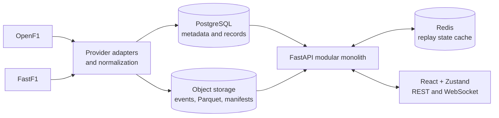
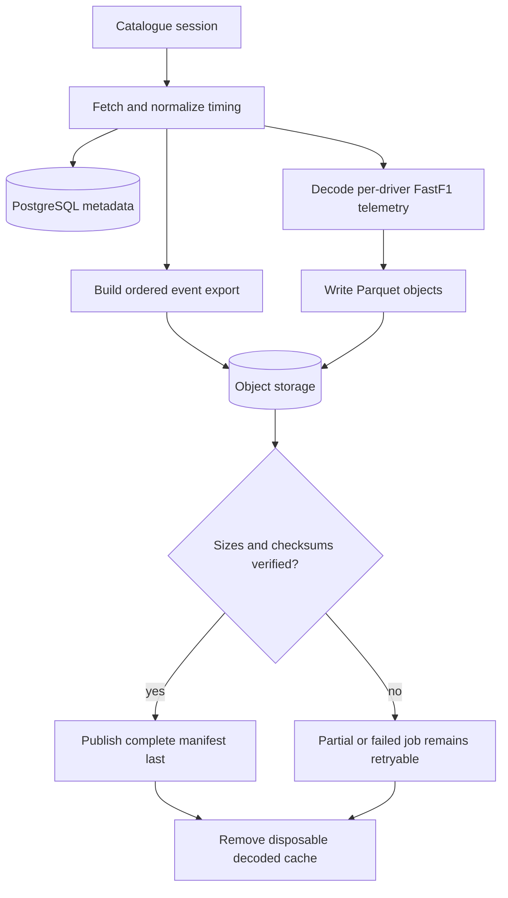
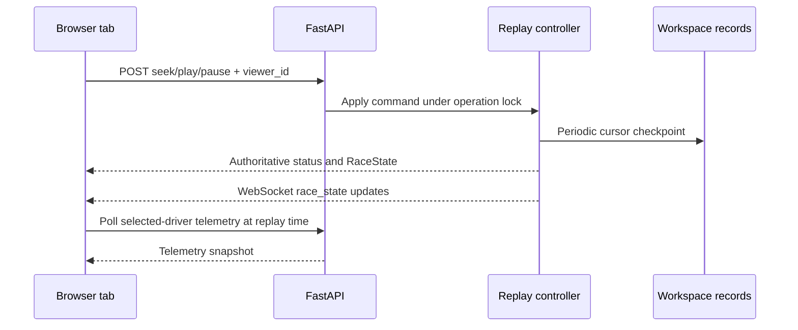

# Architecture

Pitwall is a modular monolith. One FastAPI process owns the API, replay controllers,
preparation queue and compiled React application. Durable historical data lives in
PostgreSQL and object storage; Redis and the service filesystem are disposable caches.

## System context

| Layer | Responsibility | Durable? |
| --- | --- | --- |
| Provider adapters | Fetch catalogue, timing, history and telemetry | No |
| Normalization | Convert source records into stable domain entities and events | No |
| PostgreSQL | Sessions, drivers, laps, stints, stops and versioned workspace records | Yes |
| Object storage | Compressed replay events, Parquet telemetry and completion manifests | Yes |
| Redis | Latest replay-state cache | No |
| Replay registry | Shared immutable race datasets and per-viewer controllers | No |
| FastAPI | REST, WebSocket, analysis, strategy and static frontend delivery | No |
| React frontend | Replay, Analyze and Strategy workspaces | Browser state only |

## Historical preparation

Preparation uses a bounded worker semaphore and durable job states. Startup marks
abandoned jobs as interrupted instead of silently restarting downloads. A session is
ready only after its manifest is published. S3-compatible objects are materialized
through a size-bounded local cache; successful and failed attempts both clean the
decoded FastF1 session cache.

## Replay ownership and state

Each browser tab receives a viewer UUID. The combination of viewer UUID and session
key identifies a replay controller and WebSocket channel. Controllers hold independent
cursor, speed and play state while sharing one immutable `(context, events, version)`
dataset per session. The registry retains at most two race datasets and removes idle
controllers after checkpointing them.

Replay checkpoints contain an event-dataset fingerprint. A restart restores the
cursor only when the stored fingerprint matches the current historical data, and
recovery is always paused.

## Frontend

The entry path is `frontend/index.html` → `src/main.tsx` → `src/app/App.tsx`.
`App.tsx` coordinates the session directory, replay connection and three workspaces:

| Workspace | Main responsibility |
| --- | --- |
| Replay | Timing order, map, telemetry, weather and playback controls |
| Analyze | Lap/telemetry comparison, stints, session-specific summaries and events |
| Strategy | Counterfactual dry-race pit decisions, saved scenarios and model validation |

Zustand stores the active race state, revision, connection epoch, driver selection and
telemetry. `useResource` loads cancellable REST resources. Replay state travels over a
WebSocket, while selected-driver telemetry is polled separately. Direct replay command
responses also carry authoritative state so the UI does not depend on WebSocket timing
after a seek. URL parameters (`session`, `time`, `driver`) represent shareable moments.

## Deployment constraints

- Run exactly one backend worker. Replay controllers and the preparation queue are
  process-local.
- Canonical data must remain outside the Render filesystem.
- Redis loss can discard cached state but cannot remove historical sessions.
- Generated strategy trajectories are saved as workspace records and never inserted
  into the historical event stream.
- The bounded dataset and telemetry caches are required to fit the 512 MB free web
  service used by the public deployment.
