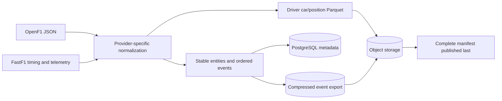

# Data sources

Pitwall combines complementary public data sources. Neither source is treated as a
complete truth for every field, and missing observations remain visible.

| Source | Used for | Stored representation |
| --- | --- | --- |
| [OpenF1](https://openf1.org/docs) | Catalogue, drivers, laps, stints, position, intervals, pit stops, race control and weather | PostgreSQL metadata plus normalized replay events |
| [FastF1](https://docs.fastf1.dev/) | Per-driver car/position telemetry, reference lap geometry and qualifying stage enrichment | Parquet telemetry plus enrichment workspace records |

The supported catalogue begins in 2023. Access and coverage vary by season, weekend and
session type. OpenF1 may temporarily restrict historical endpoints during a live F1
session. During that window, the public session directory falls back to durable
PostgreSQL records so prepared races remain browsable; ingestion can resume after the
provider window closes. Shared request spacing, retry limits and `Retry-After`
handling reduce provider pressure.

## Normalization flow

## Source boundaries

| Concern | Pitwall behavior |
| --- | --- |
| Missing intervals | Keeps position/lap data usable instead of inventing gaps |
| Missing telemetry driver | Reports partial coverage and preserves timing analysis |
| Circuit reference | Chooses a usable recorded driver lap rather than a fixed acronym |
| Qualifying stages | Uses provider timing segments instead of fixed elimination guesses |
| Corrections and duplicates | Replaces/upserts stable identities before rebuilding exports |
| Clock alignment | Preserves provider timestamps and exposes telemetry offsets |
| Official result | Stores classification separately from reconstructed running order |

Deterministic replay means the same normalized input produces the same state. It does
not mean the underlying provider observation is complete or correct. Pitwall does not
redistribute video, team radio or proprietary live timing.
