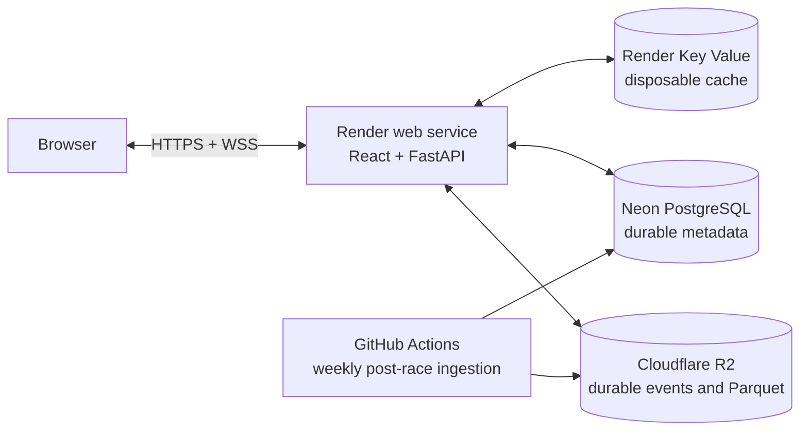

# Free public deployment

Pitwall deploys as one Docker web service: FastAPI serves the compiled React app,
REST endpoints under `/api`, and replay WebSockets under `/ws`. Keeping everything on
one origin avoids a second frontend service, CORS configuration, and separate
WebSocket routing.

Public deployment: **https://pitwall-be4a.onrender.com**



## Zero-cost stack

| Part | Service | Free-plan role |
| --- | --- | --- |
| Web app | Render free web service | Runs the combined React/FastAPI image |
| Replay state | Render free Key Value | Disposable Redis-compatible state |
| Metadata | Existing Neon free project | Durable PostgreSQL metadata |
| Replay and telemetry | Existing Cloudflare R2 Standard bucket | Durable objects below the 10 GB-month allowance |
| Post-race ingestion | GitHub Actions | Checks each Monday and publishes missing sessions |

The root `render.yaml` creates the Render web service and Key Value instance together.
Do not add a Render Postgres database: free Render databases expire after 30 days,
whereas the existing Neon database is already populated and persistent.

Render's free web service has 512 MB RAM and sleeps after 15 minutes without HTTP or
WebSocket traffic. Its first request after sleeping can take about a minute. The free
Key Value instance is in-memory and may be reset; that is acceptable because replay
controllers are disposable and historical data remains in Neon and R2.

## Deploying a new environment

1. Push the reviewed deployment changes to GitHub.
2. Rotate any R2 key that has been displayed publicly and update the GitHub Actions
   secrets with the replacement.
3. In Neon, copy the pooled connection string. The application automatically converts
   `postgresql://` to the async SQLAlchemy scheme and converts `sslmode` to `ssl`.
4. In Cloudflare R2, keep the bucket on **Standard** storage. The free allowance does
   not apply to Infrequent Access storage.

The weekly post-race workflow runs each Monday at 06:17 UTC and executes
`cloud_preflight` before starting. It refuses to ingest when stored objects already
exceed 9.5 GB, leaving headroom below R2's 10 GB-month allowance. Review R2 usage
periodically because provider usage accounting, operations, and unexpected traffic
remain external limits.

## Create the Render Blueprint

1. Sign in to Render without adding a payment method. With no payment method, Render
   suspends free services when included usage is exhausted instead of charging an
   overage.
2. Select **New → Blueprint** and connect the Pitwall GitHub repository.
3. Render reads `render.yaml`. Confirm that both resources use the **Free** plan:
   `pitwall` and `pitwall-cache`.
4. Enter only these prompted secrets:

   ```text
   DATABASE_URL=<Neon pooled PostgreSQL URL>
   S3_BUCKET=<R2 bucket name>
   S3_ENDPOINT_URL=https://<ACCOUNT_ID>.r2.cloudflarestorage.com
   S3_ACCESS_KEY_ID=<R2 access key ID>
   S3_SECRET_ACCESS_KEY=<R2 secret access key>
   ```

   `REDIS_URL` is connected automatically to `pitwall-cache`, and Render generates the
   production-only `PITWALL_ADMIN_TOKEN`. Never paste secrets into `render.yaml`.

5. Apply the Blueprint. The container builds the frontend, installs the backend,
   applies Alembic migrations, and starts one Uvicorn worker on Render's assigned port.

The deployment deliberately uses a 256 MiB local object cache. Render's filesystem is
ephemeral, so cache files can disappear safely during sleep, restart, or deployment.
Canonical data always remains in R2.

## Production invariants

| Requirement | Reason |
| --- | --- |
| One Uvicorn worker | Replay controllers and preparation queue are process-local |
| S3-compatible canonical storage | Render's filesystem is ephemeral |
| External PostgreSQL | Metadata and workspace records must survive deploys |
| Disposable Redis semantics | Losing cached replay state must not lose history |
| 256 MiB object cache | Bounds ephemeral local storage used for materialized objects |
| Complete manifest published last | Readers never treat partial uploads as ready |

## Verify the public deployment

For this project, `<APP>` is `pitwall-be4a`. For another deployment, replace it with
the hostname Render assigns:

```text
https://<APP>.onrender.com/health
https://<APP>.onrender.com/health/db
https://<APP>.onrender.com/health/redis
https://<APP>.onrender.com/api/catalog/2025
https://<APP>.onrender.com/api/sessions
```

Then open the root URL and verify:

1. A prepared race loads from R2.
2. Replay play, pause, seek, and driver selection work.
3. The circuit map and telemetry load.
4. Analyze can compare two laps.
5. Strategy can save a dry-race scenario.
6. A direct browser refresh still serves the React app.
7. The replay connection uses `wss://`.

The deployed Singapore 2025 verification loaded the session catalogue, sought within
a 29,823-event replay, synchronized Russell's completed-lap state and produced a
53-lap strategy trajectory without restarting the 512 MB service.

## Free-tier limits

- Free-plan quotas and included instance hours are account-level provider policy. Check
  the Render usage dashboard before relying on a specific monthly allowance.
- Render can suspend a free service for unusually high outbound traffic, including
  large repeated R2 downloads. The 256 MiB local cache reduces repeated reads while an
  instance remains awake.
- Render free Key Value data is not persistent. Users may lose active replay position
  after a restart and can simply reopen the session.
- R2 Standard currently includes 10 GB-month storage, 1 million Class A operations,
  10 million Class B operations, and free egress each month.
- This configuration is suitable for a résumé demonstration and light portfolio use,
  not an uptime-sensitive production service.

Provider references: [Render free services](https://render.com/docs/free),
[Render Blueprint reference](https://render.com/docs/blueprint-spec), and
[Cloudflare R2 pricing](https://developers.cloudflare.com/r2/pricing/). Check
[Neon's plan documentation](https://neon.com/docs/introduction/plans) and the Neon
console before a large metadata batch because provider allowances can change.

## Local production-image check

The same image can be built and exercised locally:

```sh
docker compose --profile deployment build production
docker compose --profile deployment up production
```

Open `http://127.0.0.1:8081`. The local Compose profile uses local storage and local
PostgreSQL/Redis; production uses the Render/Neon/R2 environment variables above.
