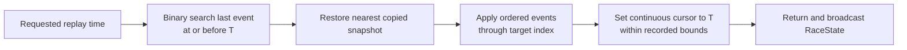

# Event and time contract

Pitwall reconstructs a session from immutable normalized events. Source rows may be
corrected or re-ingested, but a prepared event export always has deterministic identity
and ordering.

## Event shape

| Field | Meaning |
| --- | --- |
| `event_id` | Stable source-derived identity used for tie-breaking and upsert behavior |
| `meeting_key` / `session_key` | Historical scope |
| `event_type` | State transition category |
| `timestamp` | Time at which the transition becomes visible in replay |
| `driver_number` | Optional driver scope |
| `lap_number` | Optional completed or affected lap |
| `payload` | Type-specific normalized values |

Supported transitions update stint/compound, position, interval, pit count, completed
lap, race-control/safety-car state and weather. Official classification is applied as
separate recorded output; it does not overwrite reconstructed running order.

## Ordering

Events sort by this total order:

```text
(timestamp, event-type priority, event_id)
```

| Priority | Event type |
| ---: | --- |
| 10 | Stint started |
| 20 | Position changed |
| 30 | Interval updated |
| 40 | Pit stop |
| 50 | Lap completed |
| 60 | Race control |
| 70 | Weather updated |

The explicit priority makes simultaneous provider observations deterministic. Stable
IDs resolve ties within one type. Duplicate ingestion upserts source identities, while
corrections replace their corresponding normalized rows before a new export is built.

## Cursor semantics



The playback cursor is distinct from event arrival. During a tick, Pitwall first applies
every event at or before the target cursor and then broadcasts state. Between events,
the cursor continues to advance so telemetry can be sampled continuously.

Snapshots are deep copies saved every 500 events. Seek, reset and restart-after-finish
commands increment a controller revision. The frontend clears telemetry on revision
changes and rejects responses belonging to an older revision, connection epoch or
session.
