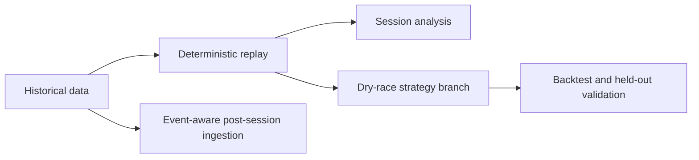

# Implementation status

The planned portfolio scope is implemented and publicly deployed. This remains an
experimental race-analysis project, not a claim of production-grade race simulation.

| Area | Implemented | Validation / remaining limitations |
| --- | --- | --- |
| Replay | Continuous clock, deterministic seeks, stale-response guards and immediate command-state synchronization | Unit regressions and deployed Singapore replay verification |
| Independent playback | Tab identities, separate channels, durable cursor recovery and shared immutable race datasets | PostgreSQL/Redis integration checks and two-viewer memory verification |
| Preparation | On-demand jobs, progress, retries, partial results, interrupted-job recovery | Job lifecycle tests; downloading new sessions depends on provider availability |
| F1 interface | Replay-first navigation, responsive timing tower, compact status, telemetry instruments, contextual glossary and three workspaces | Fourteen desktop/mobile browser checks |
| Analysis | Lap/telemetry comparison, stints, event timeline, bookmarks and classification | Deployed Singapore analysis and telemetry checks |
| Session views | Practice pace summaries, recorded qualifying stages, Race/Sprint strategy gating | Qualifying enrichment needs a prepared qualifying session; no guessed elimination cutoffs |
| Strategy | Historical/forecast branches, pit/tyre/traffic assumptions, saved comparisons, sensitivity reruns and recorded-stop backtesting | Determinism and future-data-isolation tests; approximate lap-level model |
| ML | Training, session-separated holdout, versioned results, five-percent eligibility margin and deterministic fallback | Eight 2024 races trained with Singapore 2025 held out: 0.770s MAE versus 0.823s baseline; accepted with temporal season separation |
| Operations | Dockerfiles, full Compose stack, CI, health endpoints, request metrics, local/S3 canonical storage, verified manifests, cache cleanup, resumable catalogue preparation, chunked FastF1 telemetry export, event-aware post-session ingestion and same-origin Render deployment | Public deployment verified against Neon/R2; full-race ingestion measured at 243 MB peak against the free 512 MB worker |

Use a single backend worker. There are no viewer accounts in this local-first
application; an administrator token protects preparation endpoints. Viewer IDs
separate playback but are not an authorization boundary.
Browser checks use deterministic API fixtures; the opt-in integration check uses
real local PostgreSQL/Redis and prepared session data. The public Singapore 2025
check covered catalogue loading, a 29,823-event replay, seeking, selected-driver lap
state and a complete 53-lap strategy trajectory without exceeding the Render memory
limit.

Real Saudi data exposed and helped fix missing stint starts and safety-car
clearance handling. Practice ingestion now tolerates absent interval feeds.
Recorded-stop validation covered 82 cases across five dry races. Mean session MAE
was 11.09s versus 13.73s for constant pace, with the model winning four of five
races. Bahrain remained worse than baseline. These are horizon elapsed-time errors,
not per-lap accuracy or evidence of counterfactual correctness.

## Verification summary

| Check | Current result |
| --- | --- |
| Backend unit suite | 57 passing |
| Frontend state/geometry suite | 8 passing |
| Desktop/mobile browser suite | 14 passing |
| Production health and catalogue | Passing |
| Singapore 2025 production replay | 29,823 events loaded and seeked |
| Production strategy path | 53-lap trajectory returned |
| Local two-viewer memory exercise | 342.9 MB peak against a 512 MB target |

## Deliberately outside current scope

- Live timing and live-session replay
- Wet/intermediate strategy calibration
- Reactive opponent strategy and full overtaking simulation
- Verified official tyre-set allocation and complete FIA regulation enforcement
- User accounts or multi-tenant authorization
- Multiple backend workers without a shared controller/job coordinator
