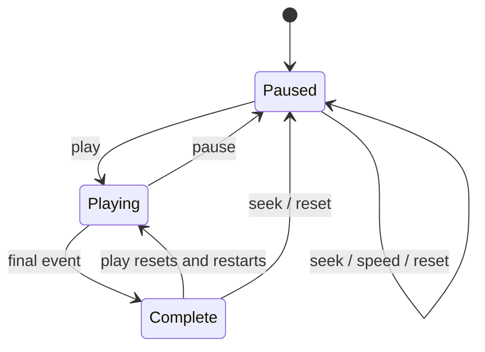

# Replay correctness

The historical event stream remains deterministic: events are sorted by timestamp,
event priority, and stable event ID. Event-index seeks restore a copied snapshot
and apply the remaining events. Time seeks apply every event at or before the
requested timestamp, then retain that timestamp as the playback cursor, clamped
to session start and the final recorded event.



During playback, a monotonic clock advances the cursor every 50 ms. All events
through that cursor are applied before broadcasting. The controller limits normal
broadcasts to 10 Hz. Telemetry still uses HTTP polling every 250 ms, so its display
can lag the latest broadcast by the polling interval plus request latency; it is
not a frame-perfect stream. The continuous cursor allows telemetry to progress
even when no race event occurs.

Pause cancels pending playback before it can apply another event. Reset and seek
hold the operation lock across stopping playback and changing state. Completion
clears the playing flag before the final broadcast. Speed changes are sampled on
the next playback tick.

Each seek, reset, or restart after completion increments the controller's revision.
WebSocket state includes that revision. The frontend clears telemetry on revision
changes and rejects in-flight telemetry from previous revisions or sessions.
Disconnected WebSocket callbacks are detached and also check socket identity and
the active session. Selecting the already active session is a no-op.

The map and replay controls are keyed by session so their local loading, error,
and slider state cannot carry into another session. The slider retains a user's
scrub value while incoming playback updates continue.

Replay command responses contain the same authoritative `RaceState` shape used by the
WebSocket. The frontend applies that response immediately after play, pause, reset,
speed and seek operations. This prevents a user from opening Strategy with a stale
completed-lap value while waiting for a WebSocket message.

## Correctness invariants

| Invariant | Enforcement |
| --- | --- |
| Same dataset and cursor produce the same state | Total event order and pure event application |
| Seeking never mutates a saved snapshot | Snapshot store returns deep copies |
| Old telemetry cannot overwrite a seek | Revision, session and connection-epoch checks |
| Pause cannot apply a later pending event | Playback task cancellation under the operation lock |
| Visitors do not control each other's cursors | Viewer UUID and session key scope each controller/channel |
| Restart never resumes motion unexpectedly | Restored checkpoints are paused |
| Changed history cannot reuse an old cursor | Dataset fingerprint validation |
| Official results do not rewrite replay order | Classification is maintained separately |

## Checks

From `backend/`:

```sh
../.venv/bin/python -m pytest -q
```

From `frontend/`:

```sh
npm test
npm run lint
npm run build
```

Frontend regression tests use Node's built-in runner and the existing TypeScript
compiler, without an additional test dependency.

## Recovery and deployment

Replay controllers now use a tab-scoped viewer identity plus historical session key.
PostgreSQL checkpoints restore the cursor paused after a restart, provided the
context/event dataset fingerprint matches. Idle controllers without connected viewers
are checkpointed and removed after two minutes. A browser connection epoch also
rejects pending telemetry across reconnects even if a revision number repeats.

Immutable context/events are cached separately from controllers. Multiple viewers of
one race share that dataset, while their mutable replay states remain independent. The
registry retains at most two race datasets to bound memory on the 512 MB deployment.

The deployment is single-process. The cursor ends at the last normalized event,
not an independently stored session-end boundary. See implementation-status.md for
integration and browser checks and remaining modeling limitations.
