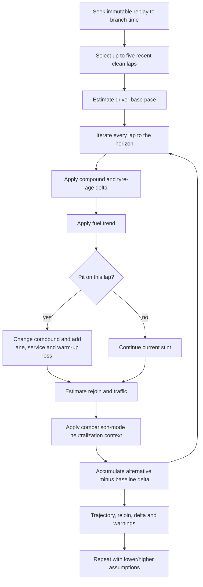
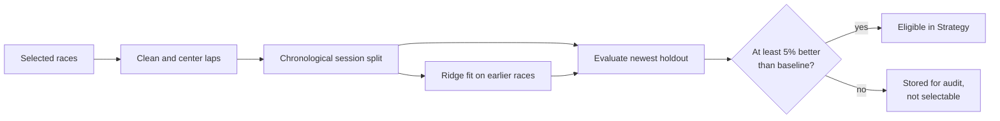

# Strategy model

Pitwall answers a constrained question: from a recorded replay moment, how does one
alternative dry-tyre pit plan compare with a selected baseline under explicit lap-level
assumptions? It does not predict an exact finishing position or simulate reactive teams.

## Request and eligibility

| Input | Purpose |
| --- | --- |
| Session, driver and timestamp | Identify the historical branch state |
| Pit lap and compound | Define the alternative call |
| Horizon | Set the final comparison lap |
| Comparison mode | Recorded future or a second decision-time plan |
| Pit/service assumptions | Model travel through the lane and stationary time |
| Pace assumptions | Degradation, fuel gain and warm-up loss |
| Traffic assumptions | Approximate cost after rejoining near another car |
| Safety-car multiplier | Reduce pit-lane loss during a neutralization |
| Available compounds/rule toggle | Apply the user's supplied dry-tyre constraints |
| Uncertainty fraction | Produce low/high assumption variants |

A branch is accepted only when:

- the session is a Race or Sprint;
- the selected driver is present and has not retired, failed to start or been
  disqualified at the branch;
- pit and horizon laps follow that driver's last completed lap;
- at least three clean, non-pit-out, non-neutralized laps exist before the branch; and
- both the current and requested compounds are Soft, Medium or Hard.

When enabled for a Race, the user-supplied compound constraint requires at least two
distinct dry compounds across recorded and proposed stints. Pitwall does not know the
driver's official tyre-set inventory.

## Simulation pipeline



The transparent model estimates base pace as the median of up to five recent laps after
removing the configured tyre-age effect and normalizing the lap relative to the branch
with the fuel-gain assumption. For each future lap, the simplified pace relationship is:

```text
predicted lap = base pace
              + compound/tyre-age delta
              - fuel gain since branch
              + pit and warm-up loss when stopping
              + estimated traffic loss
              + observed neutralization slowing in historical mode
```

Rejoin estimates hold opponents at their branch-point numeric gaps. They are useful for
showing the likely traffic band after a stop; they are not a dynamic overtaking model or
predicted classification.

## Comparison modes

| Mode | Baseline | Future information | Intended question |
| --- | --- | --- | --- |
| Historical | Recorded future lap times | Uses recorded laps and neutralizations | How would this call compare in the race that occurred? |
| Decision-time (`forecast`) | User-defined second stop plan | Uses pre-branch pace and holds branch conditions constant | Which of these two plans looks better using information available now? |

Historical mode replaces the driver's next recorded stop and preserves later recorded
stops. It requires complete recorded laps through the horizon. Decision-time mode
requires an explicit baseline pit lap and compound and rejects model data that would
not have existed at the branch.

## Sensitivity output

The central run uses the submitted assumptions. Two additional runs multiply
degradation, pit-lane loss and traffic penalty by `(1 - uncertainty)` and
`(1 + uncertainty)`. The minimum and maximum deltas become the displayed range.

This range answers “How much does the result move under these chosen variations?” It
is not a probability distribution or statistical confidence interval.

## Optional pace model

The optional ML module is a small versioned ridge regression over pace deltas. It is a
guarded replacement for the compound/age curve, not a separate race simulator.

| Feature | Encoding |
| --- | --- |
| Intercept | `1` |
| Tyre age | Linear term |
| Tyre age squared | `age² / 100` |
| Soft compound | Indicator |
| Hard compound | Indicator; Medium is the reference |

Clean laps must use a dry compound, have tyre age, avoid pit-out and neutralized laps,
and fall between 40 and 200 seconds. Laps more than five seconds from that driver's
session median are removed. The target is lap time minus the driver/session median,
which controls much of the driver and circuit base pace.

Sessions are sorted chronologically. All but the newest train the model; the newest is
the holdout. Every session needs at least 30 clean laps. Version 2 models become
selectable only if holdout MAE is at least 5% below a zero pace-delta baseline.



Even an accepted model falls back to the transparent tyre model when:

- the simulated session was used for its training or holdout;
- decision-time use would expose data at or after the branch;
- the requested compound was not observed in training; or
- tyre age is outside the trained range.

## Interpretation limits

- Wet and intermediate pace is not calibrated.
- Fuel, track evolution and traffic remain confounders in the learned model.
- Opponent stops and pace do not react to the alternative.
- Overtaking, penalties, red flags and detailed regulation edge cases are simplified.
- Recorded-stop validation measures reproduction of observed elapsed time, not causal
  counterfactual truth.
- Circuit-specific calibration and broader held-out testing would be required before
  treating estimated gains as operational recommendations.

See [strategy validation](strategy-validation.md) for measured results and the exact
report command.
