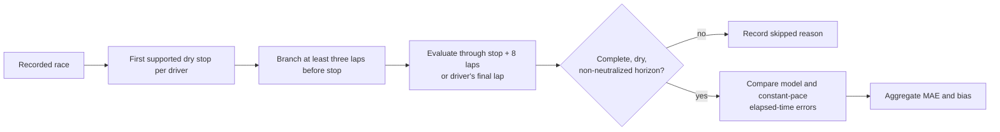

# Strategy validation

Pitwall's strategy output remains experimental. Validation replays each driver's
first supported dry stop from a branch at least three laps earlier, follows the next
eight laps, and compares predicted elapsed time with the recorded elapsed time. A
constant recent-pace estimate with the same pit/service loss is the baseline.



Mixed-weather races are excluded because wet-track pace is not calibrated. Individual
cases are excluded when their horizon contains neutralization, missing laps, a wet
compound or an abnormal lap duration. A race needs at least five supported cases for
the aggregate report.

| Metric | Definition |
| --- | --- |
| Case error | Predicted alternative elapsed time minus recorded elapsed time |
| Model MAE | Mean absolute case error within a session |
| Baseline MAE | Mean absolute error from recent median pace plus pit/service/warm-up loss |
| Bias | Mean signed model error; positive means the estimate was slower than recorded |
| Evidence threshold | At least five supported drivers for a reported race |

## Recorded-stop results

| Session | Cases | Model MAE | Baseline MAE | Result |
| --- | ---: | ---: | ---: | --- |
| Bahrain 2024 | 20 | 16.80s | 13.83s | Baseline better |
| Monaco 2024 | 6 | 17.09s | 23.80s | Model better |
| Singapore 2024 | 20 | 6.86s | 9.17s | Model better |
| Saudi Arabia 2025 | 16 | 6.15s | 11.92s | Model better |
| Singapore 2025 | 20 | 8.57s | 9.93s | Model better |

Across 82 supported cases, mean session MAE was 11.09 seconds versus 13.73 seconds
for the baseline. The model beat the baseline in four of five races. Canada 2024 and
São Paulo 2024 were excluded as mixed-weather races. Australia 2026 had only three
supported cases and did not meet the evidence threshold.

## Pace-model result

The ridge pace model trained on eight 2024 races: Bahrain, Saudi Arabia, Australia,
Japan, Spain, Britain, Italy and Singapore. Singapore 2025 was held out, providing
temporal separation between the training season and evaluation race. It used 7,473
training laps and 1,161 holdout laps. Holdout MAE was 0.770 seconds; the
constant-delta baseline achieved 0.823 seconds. The 6.4% improvement passes the
version 2 requirement. Models still fall back to deterministic behavior on their
training or holdout sessions, with future data, or outside their compound/age range.
Older stored models are ineligible.

| Pace validation | Value |
| --- | ---: |
| Training races | 8 |
| Training laps | 7,473 |
| Holdout race | Singapore 2025 |
| Holdout laps | 1,161 |
| Ridge-model MAE | 0.770s |
| Constant-delta MAE | 0.823s |
| Relative improvement | 6.4% |
| Eligibility threshold | 5.0% |

These results show useful signal in supported dry races, but performance varies by
circuit. They do not establish causal accuracy for alternative strategies. Opponent
responses, overtakes, penalties, tyre inventory, wet conditions and detailed race
interruptions remain outside the model.

Reproduce the report from `backend/` with:

```sh
../.venv/bin/python -m scripts.validate_strategy \
  --sessions 9472 9523 9531 9606 9636 10022 9896 11234 \
  --training-sessions 9472 9480 9488 9496 9539 9558 9590 9606 9896
```
